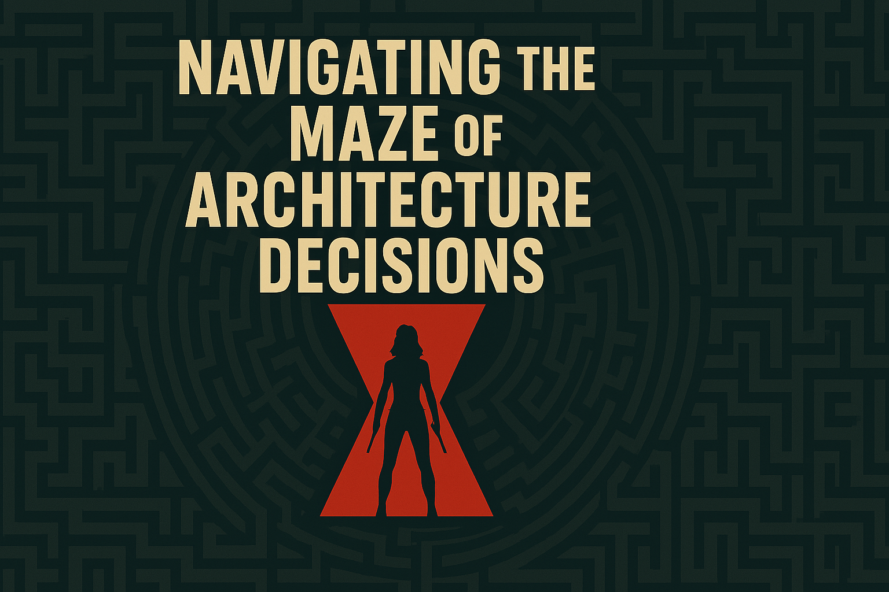

# Navigating the Maze: Communicating Architecture Decisions with Architecture Decision Records

## Elevator Pitch
Discover how Architecture Decision Records (ADRs) enhance communication in software architecture. Learn best practices and real-world applications.

## Abstract
In software architecture, it is important to know why a team has selected a specific architectural style, pattern, or technology. Clear communication of such decisions is crucial, and one of the best means to capture, communicate, and understand these decisions is through Architecture Decision Records (ADRs). This session will emphasize ADRs as an instrument that enables unambiguous communication among architectural stakeholders.

Using real-world examples, we’ll explain the fundamental principles of ADRs, highlighting how they encapsulate the rationale, context, and consequences of architectural decisions. We will also cover best practices for authoring, maintaining, and evolving ADRs throughout the project lifecycle, from initiation to implementation.

Regardless of whether you're an architect or a developer new to the space, with this session, you shall be well equipped with the tools to articulate architecture decisions using ADRs. Get familiar with the architectural maze so you can manage it with confidence and clarity, and be prepared to respond to the all-important question of why — now, tomorrow, and in the future.

## Short Abstract

In software architecture, understanding why specific decisions are made is crucial. Architecture Decision Records (ADRs) document, share, and clarify these choices. This session explores ADRs’ role in transparent communication, covering core principles, real-world examples, and best practices. Learn to leverage ADRs for collaboration, risk mitigation, and maintaining architectural integrity. Equip yourself to navigate the architectural maze confidently.

# Type
- 45/60/75-minute session

## Tags
- Architecture
- Architecture Decision Records
- Best Practices
- Communication
- Project Management
- Software Development

## Learning Objectives
- Recognize the significance of Architecture Decision Records (ADRs) in enhancing communication within architectural teams.
- Understand how ADRs document architectural decisions with real-world examples.
- Learn best practices for creating, managing, and evolving ADRs to support collaboration and maintain architectural integrity.

## Prerequisites
Here are the prerequisites to attend the presentation “Navigating the Maze: Communicating Architecture Decisions with Architecture Decision Records”:

- **Basic Understanding of Software Architecture**: Familiarity with fundamental concepts of software architecture, including architectural styles, patterns, and technologies.
- **Experience with Software Development**: Practical experience in software development, as the session will discuss real-world examples and case studies.
- **Interest in Documentation Practices**: A keen interest in learning about documentation practices, particularly Architecture Decision Records (ADRs).
- **Collaboration Skills**: Willingness to engage in discussions and share experiences related to architectural decision-making and documentation.
- **Open Mindset**: An open mindset to learn new techniques and best practices for creating, managing, and evolving ADRs.

These prerequisites will help you get the most out of the session and actively participate in the discussions.

## Presentations

| Event | Location | Date | Time | Room | Downloads |
|-------|:--------:|-----:|-----:|-----:|----------:|
| [Momentum 2024](https://momentumdevcon.com/) | Cincinnati, OH | October 17, 2024 | 12:40 PM EDT | River B | [Slides](EventMaterials/NavigatingTheMaze-Momentum2024.pdf) \| [ADR Examples](Demos/readme.md) |

Email [chadgreen@chadgreen.com](mailto:chadgreen@chadgreen.com?subject=Presentation%20Request:%20Navigating%20the%20Maze) to have Chad present this session at your event.

## Resources

There are no additional resources for this presentation.
